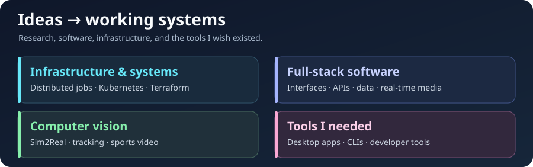

# Hi, I'm HongYu 👋

I'm a master's student who works across **infrastructure, full-stack software, and computer vision**. I enjoy designing the whole system around an idea—interfaces, APIs, data, workers, and deployment. My current research focuses on Sim2Real vision for sports, especially volleyball and basketball; outside research, I tend to build a tool when a workflow needs something that doesn't exist yet.

 

## What I work on

- **Infrastructure & system design:** service boundaries, asynchronous jobs, distributed task processing, containers, Kubernetes GPU workers, NVIDIA MIG, Terraform, CI/CD, networking, and self-hosted services.
- **Frontend & backend:** web and mobile interfaces, APIs, databases, real-time communication, storage, and media workflows.
- **Computer vision:** synthetic data, detection and tracking, pose, camera geometry, multi-camera video, and sports analysis.
- **Tools for my own needs:** small desktop apps, CLIs, and developer tools that remove friction from my daily work.

## Tools I use

This is a mix of tools from current projects, earlier work, and experiments.

**Languages**

         

**Vision & simulation**

    

**Frontend & apps**

       

**Backend & data**

          

**Infrastructure & media**

         

## Languages in my public repositories

Ranked using code size and repository count; notebooks and build-file formats are excluded. This reflects public code, not proficiency.

GitHub activity

## A few examples

**Sports vision & systems**

- [Volleyball Analysis Engine](https://github.com/henry753951/volleyball-analysis-engine) — detection, tracking, pose, and analysis in a **Python / PyTorch / OpenCV / Docker** worker.
- [Volleyball Monitoring AI](https://github.com/henry753951/volleyball-monitoring-ai) — live annotation and video workflows across **Nuxt / Vue / TypeScript**, **Fastify / GraphQL Yoga / Prisma / PostgreSQL**, and **Redis / MinIO / WebSocket / FFmpeg / OvenMediaEngine / Traefik**.
- [NeuralCourt Basketball](https://github.com/henry753951/neuralcourt-basketball) — a **Unity / C#** basketball simulation with GPU-batched character motion and multi-camera monitoring.

**Tools I built because I needed them**

- [TartUI](https://github.com/henry753951/TartUI) — a **SwiftUI** interface for managing Tart images and virtual machines on macOS.
- [k8s-mig-manager](https://github.com/henry753951/k8s-mig-manager) — a **Bun / TypeScript / Ink** CLI for NVIDIA MIG profiles on Kubernetes nodes.
- [Snip](https://github.com/henry753951/snip) — a **SwiftUI / yt-dlp / FFmpeg** app for downloading and clipping video.
- [Cloudflare Catch-all Mailbox](https://github.com/henry753951/cloudflare-catchall-mailbox) — a searchable inbox API built with **Workers / D1 / R2**.
- [Nuxt Imperative Modals](https://github.com/henry753951/nuxt-imperative-modals) — a **Nuxt / Vue / TypeScript** module for opening typed modals from code.

More experiments and projects are on my [repositories page](https://github.com/henry753951?tab=repositories).
