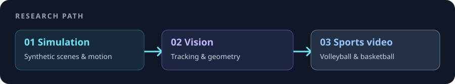

# Hi, I'm HongYu 👋

I'm a master's student working on **computer vision**, especially **Sim2Real** for sports. I'm interested in synthetic data, tracking, camera geometry, and what it takes to make vision systems useful on real volleyball and basketball footage.

 

## What I'm exploring

`synthetic data → real footage` · `detection & tracking` · `multi-camera geometry` · `sports video understanding`

## Selected projects

- **[NeuralCourt Basketball](https://github.com/henry753951/neuralcourt-basketball)** — a Unity basketball simulation with GPU-batched character motion and multi-camera monitoring.
- **[Volleyball Analysis Engine](https://github.com/henry753951/volleyball-analysis-engine)** — a Python worker for volleyball detection, tracking, pose, and analysis.
- **[Volleyball Monitoring AI](https://github.com/henry753951/volleyball-monitoring-ai)** — live annotation, video workflows, and integration with an external vision system.
- **[TartUI](https://github.com/henry753951/TartUI)** — a native macOS interface for Tart virtual machines.

## Tools I use

     

On the engineering side, I build backend services and GPU workers for parallel tasks on Kubernetes. That work supports my experiments alongside Linux, Docker, and CI/CD.

GitHub activity

